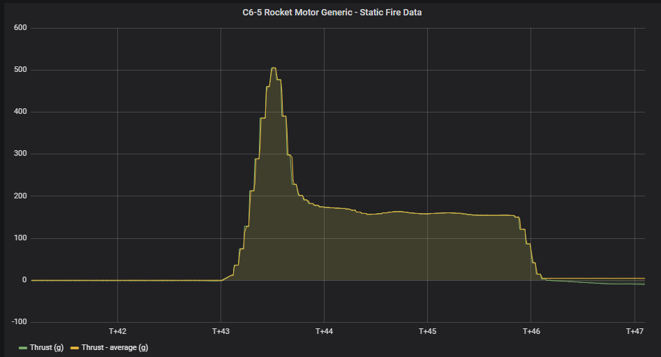
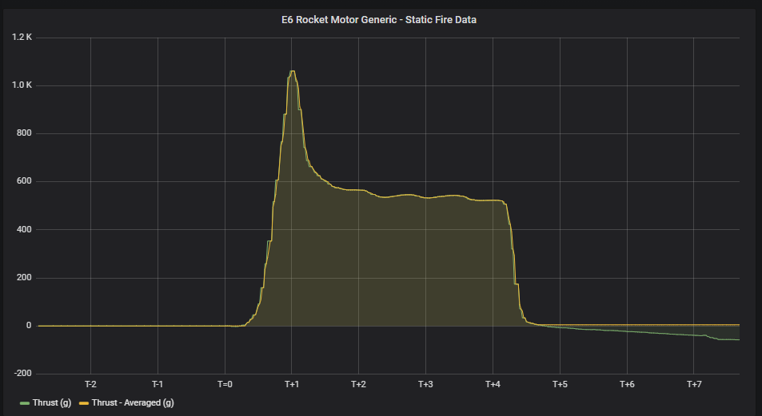

# Introduction: 
I built this as a pilot project to get some experience before I attempt to build a hopefully more complex rocket in the future and I learnt quite a bit about soldering and assembling a full system like this. This repo should
serve as a resource for people looking to build a motor test stand similar to this, as I found that this topic wasn't covered much anywhere in detail.

## Here is example data from two different motors:

# How it works:
The system does 3 main things: 
- Reads and Logs thrust data. 
- Manages the countdown and ignition of the motor, as well as the calibration of the loadcell. 
- Produces noises and light appropriate for the current situation.
  
Ignition and data recording is automated from the beginning of the countdown to the end of the burn. Data is logged in a CSV file and I've written a very simple "protocol" to read from a config file (where most settings can be adjusted), the format of which is borrowed from Joe Barnard (Thanks Joe). 

The system also waits for a period of time after burnout to make sure that it has not incorrectly detected burnout and that we don't lose any data as a result.
## Loadcell Calibration: 
When you start up the system, you will be prompted to calibrate the Loadcell. The process produces a calibration value that is automatically saved to the config file and can be loaded instead of repeating the calibration process. Keep in mind that the loadcell is tared when loading the calibration value from the config file and the loadcell is very sensitive to temperature.  (tare - getting the zero offset)
## Some Additional Notes
- DO NOT use a 9V battery for this like I did. Those things cant do anything meaningful. 😅